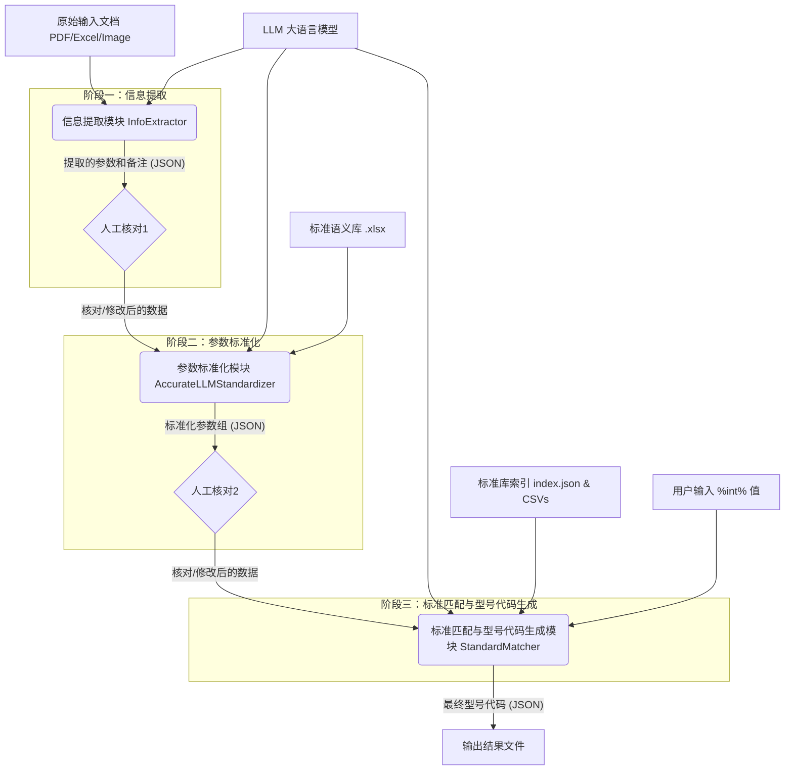
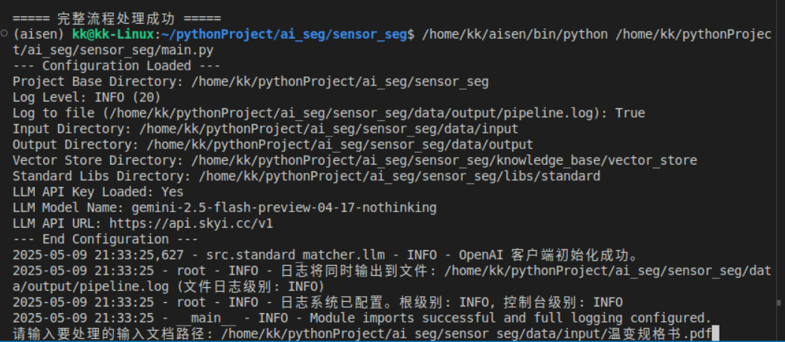
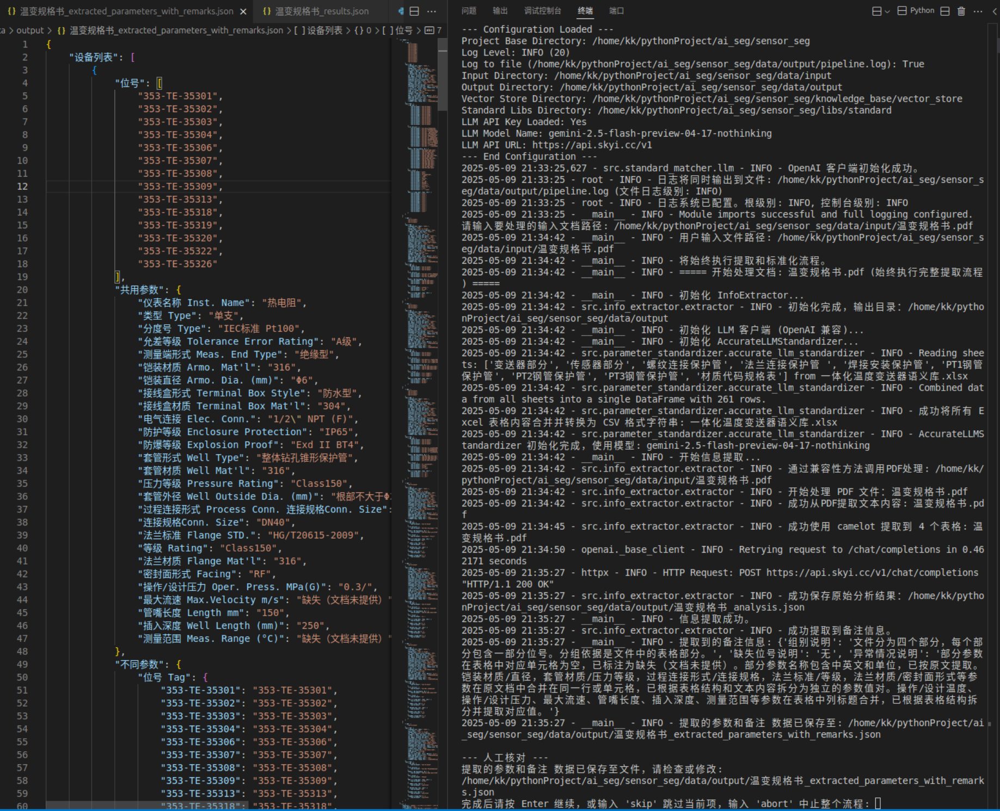
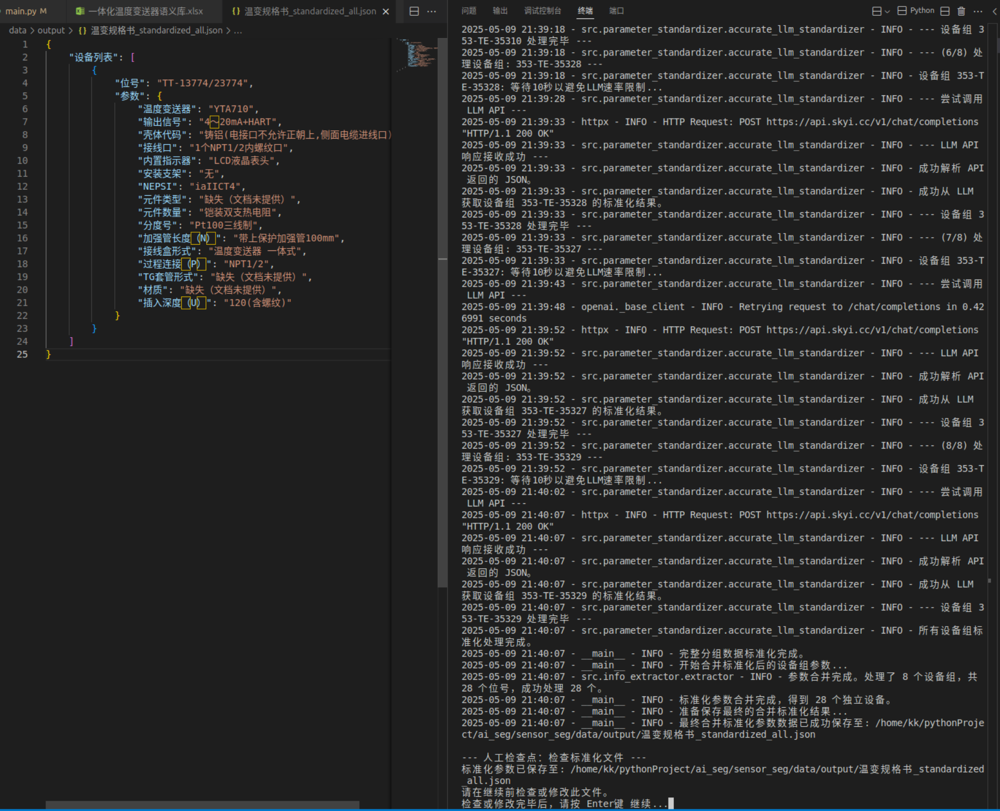
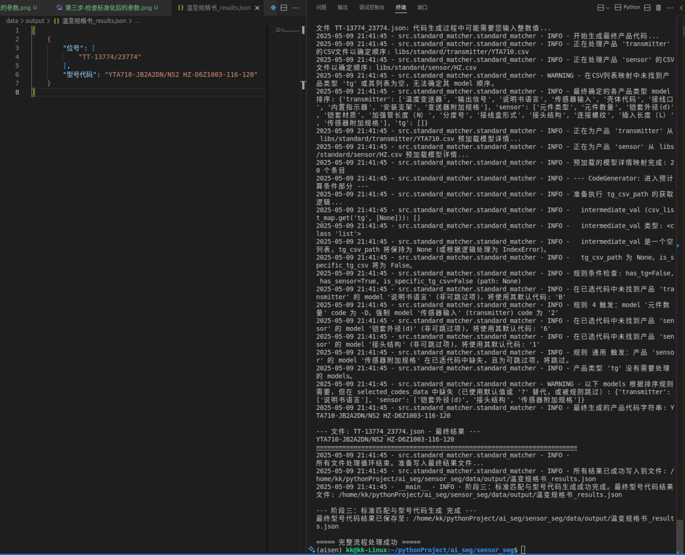

# 智能传感器型号代码生成系统

## 1. 项目概述

本项目旨在从传感器设备的技术规格文档（如 PDF、Excel 文件或图片）中自动提取关键参数，对这些参数进行标准化处理，并最终根据标准化后的参数与预定义的标准库进行匹配，生成符合规范的产品型号代码。系统深度集成了大语言模型 (LLM) 的能力，并在关键环节引入人工核对机制，以确保处理的准确性和灵活性。

## 2. 系统架构

系统主要由三个核心处理阶段构成，数据在这些阶段中依次流转并得到处理：

1.  **信息提取阶段**: 从原始输入文档中提取参数信息。
2.  **参数标准化阶段**: 将提取到的多样化的参数表达统一为标准格式。
3.  **标准匹配与型号代码生成阶段**: 将标准化参数与标准库匹配，并生成最终型号代码。

**数据流转示意图 (Mermaid 语法):**



**关键特性**:

*   **LLM 驱动**: 在信息提取、参数标准化、标准库选择、模型匹配和代码选择等多个环节利用 LLM 进行智能处理。
*   **人机协作**: 在信息提取完成后和参数标准化完成后设置了人工核对点，允许用户检查和修正中间结果，确保数据质量。在型号代码生成过程中，对于需要具体数值的参数（如长度），系统会提示用户输入。
*   **模块化设计**: 功能被清晰地划分到不同的模块中，易于理解和维护。
*   **配置化**: 系统行为（如 LLM API密钥、模型名称、提示词等）通过配置文件进行管理。

## 3. 核心流程详解

### 3.1 信息提取阶段

*   **输入**: 用户提供的传感器规格文档（PDF、Excel 或图片格式）。
*   **处理**:
    *   `InfoExtractor` 模块负责此阶段。
    *   **文件类型检测**: 自动识别输入文件类型。
    *   **内容处理**:
        *   **PDF**: 结合多种策略：
            *   将 PDF 页面转换为 Base64 编码的图像数据，供 LLM 进行视觉分析。
            *   使用 `pdfplumber` 提取纯文本内容。
            *   使用 `camelot` 提取表格数据，并转换为 CSV 格式。
            *   整合图像、文本和表格信息，构建丰富的上下文交由 LLM 处理。
        *   **Excel**: 使用 `pandas` 读取，并将内容转换为 CSV 字符串。
        *   **图片**: 转换为 Base64 编码。
    *   **LLM 参数提取**: 将处理后的文件内容（图像、文本、表格）连同预设的提取指令 (Prompt) 发送给 LLM，由 LLM 提取参数信息（通常包括参数名、参数值、位号、共用参数、不同参数、备注等）。
*   **输出**: 包含提取出的参数和备注信息的 JSON 文件 (例如 `*_extracted_parameters_with_remarks.json`)。
*   **人工核对1**: 系统会提示用户检查并可选择修改此输出文件，确保提取的准确性。

### 3.2 参数标准化阶段

*   **输入**: 上一阶段生成并经人工核对/修改后的参数 JSON 文件。
*   **处理**:
    *   `AccurateLLMStandardizer` 模块负责此阶段。
    *   **分批处理**: 为了处理可能包含多个设备组的输入数据，并避免 LLM 上下文超长，标准化过程按设备组分批进行。
    *   **标准语义库参考**: 加载 `libs/一体化温度变送器语义库.xlsx` 文件，将其内容（包含标准参数名、标准值、描述等）转换为 CSV 字符串，并嵌入到发送给 LLM 的 Prompt 中，作为核心的标准化依据。
    *   **LLM 精确标准化**: 结合原始参数、标准语义库以及精心设计的 Prompt (`src/parameter_standardizer/standardized_prompt.txt`)，调用 LLM 对当前设备组的参数进行标准化。LLM 的任务是将原始参数的键和值转换为标准库中定义的规范表达。
    *   **API 调用延迟**: 为避免触发 LLM 服务端的速率限制，每次调用 LLM API 前会有固定时长的等待。
*   **输出**: 包含标准化后参数组的 JSON 文件 (例如 `*_standardized_all.json`)。每个设备组会包含 "位号"、"标准化共用参数" 和 "标准化不同参数"。
*   **人工核对2**: 系统再次提示用户检查并可选择修改此标准化结果文件。

### 3.3 标准匹配与型号代码生成阶段

*   **输入**: 上一阶段生成并经人工核对/修改后的标准化参数 JSON 文件。
*   **处理**:
    *   `StandardMatcher` 模块及其内部子组件 (`FetchCsvlist`, `ModelMatcher`, `CodeSelector`, `CodeGenerator`) 协同完成此阶段。
    *   **文件拆分**: 首先，使用 `AnalysisJsonProcessor` 将输入的标准化参数文件（可能包含多个设备的参数）拆分成单个设备参数文件，存储于 `data/output/temp/` 目录。后续处理针对每个拆分后的文件进行。
    *   **获取 CSV 标准库列表 (`FetchCsvlist`)**:
        *   根据当前设备的标准化参数和 `libs/standard/index.json` 中定义的各产品类型（如 "transmitter", "sensor", "tg"）的关键词，通过 LLM 辅助选择最匹配的关键词。
        *   基于选定的关键词，从 `index.json` 中获取该产品类型对应的具体标准 CSV 文件列表（这些 CSV 文件位于 `libs/standard/` 下的相应子目录）。
    *   **模型匹配 (`ModelMatcher`)**:
        *   将当前设备的标准化参数（键值对）与从选定 CSV 文件中加载的标准模型条目进行匹配。
        *   采用两阶段匹配：首先进行基于字符串相似度的**模糊匹配** (`thefuzz`库)，然后对模糊匹配失败或不确定的项，利用 **LLM 进行智能匹配**。
        *   目标是为每个输入参数找到一个唯一的标准模型。
    *   **代码选择 (`CodeSelector`)**:
        *   对于每个输入参数及其匹配到的多个候选标准模型行，选择最合适的一行。
        *   同样采用两阶段选择：先**模糊选择**（比较输入参数值与候选行描述/参数的语义相似度），然后对模糊选择失败的项，利用 **LLM 进行智能选择**。
        *   **处理 `%int%` 占位符**: 如果选定行的标准代码 (code) 中包含 `%int%` (如表示长度、直径等需要具体数值的参数)，会尝试从原始输入参数的**值**中提取数字进行替换。
    *   **型号代码生成 (`CodeGenerator`)**:
        *   **确定模型顺序**: 根据各产品类型在对应标准 CSV 文件（通常是列表中的第一个）中 'model' 列的出现顺序，确定最终型号代码中各部分的排列顺序。
        *   **应用规则与默认值**: 依据一系列预定义的复杂规则（硬编码在 `CodeGenerator` 中）处理特定模型在特定条件下的代码。这些规则可能涉及跳过模型、强制使用特定代码，或根据其他已选模型的代码来决定当前模型的代码。
        *   **标准查找与默认值**: 如果模型未被特定规则处理，则从 `CodeSelector` 的输出中查找其代码。若找不到，且模型不是预设的可跳过项 (`SKIPPABLE_MODELS`)，则尝试使用从所有相关 CSV 中预加载的该模型的默认代码。如果连默认代码也没有，则使用 "?" 作为占位符。
        *   **处理 `%int%` (用户输入)**: 如果最终确定的代码（无论是来自选择、规则还是默认值）包含 `%int%` 占位符，系统会**在控制台提示用户输入一个整数值**。用户输入的值将替换 `%int%`。如果用户直接回车跳过，则使用 "?" 替代。
        *   **代码拼接**: 将同一产品类型的所有有效代码（按预定顺序）连接起来形成一个代码块。然后，将不同产品类型（如 "transmitter", "sensor", "tg"）的代码块用空格分隔，形成最终的型号代码字符串。
*   **输出**: 包含所有处理成功的设备的位号及其生成的型号代码的 JSON 文件 (例如 `*_results.json`)。
*   **API 调用延迟**: 在处理每个拆分后的文件之间，以及在某些 LLM 调用密集的步骤（如 `CodeSelector` 的批处理）中，会引入延迟，以避免对 LLM 服务造成过大压力。

## 4. 主要模块介绍

### 4.1 `src/info_extractor/extractor.py` (`InfoExtractor`)

*   **职责**: 从多种格式的源文档中提取原始参数信息。
*   **核心功能**:
    *   支持 PDF、Excel、常见图片格式。
    *   对 PDF 进行多模态处理：图像内容 (Base64)、`pdfplumber` 文本提取、`camelot` 表格提取。
    *   将处理后的内容（包括图像、文本、表格CSV）和系统提示词 (`prompts.LLM_EXTRACTION_SYSTEM_PROMPT`) 提交给 LLM 进行参数提取。
    *   包含 `JSONProc` 内部类，用于后续参数合并 (`merge_parameters`) 和备注提取 (`extract_remarks`)。

### 4.2 `src/parameter_standardizer/accurate_llm_standardizer.py` (`AccurateLLMStandardizer`)

*   **职责**: 将提取出的、经过人工核对的参数进行精确标准化。
*   **核心功能**:
    *   接收 LLM 客户端。
    *   加载详细的标准化 Prompt 模板 (`standardized_prompt.txt`)。
    *   加载并处理 "完整语义表" (`libs/一体化温度变送器语义库.xlsx`)，将其作为核心参考资料嵌入 Prompt。
    *   对输入的每个设备组：
        *   构建包含原始参数和完整语义表的 Prompt。
        *   调用 LLM 进行标准化，输出 "标准化共用参数" 和 "标准化不同参数"。
    *   采用分批处理和 API 调用延迟策略。

### 4.3 `src/standard_matcher/standard_matcher.py` (`StandardMatcher` 及子组件)

这是一个功能非常集中的模块，包含了从标准库选择到最终代码生成的多个步骤。

*   **`execute_standard_matching` (主协调函数)**:
    *   调用 `AnalysisJsonProcessor` 将主输入文件按设备拆分为临时 JSON 文件。
    *   迭代处理每个临时文件，依次调用以下组件。

*   **`FetchCsvlist`**:
    *   根据当前设备的参数和 `libs/standard/index.json`，利用 LLM 辅助为各产品类型（transmitter, sensor, tg）选择最合适的关键词。
    *   根据选定关键词从索引中获取对应的标准 CSV 文件列表。

*   **`ModelMatcher`**:
    *   将当前设备的标准化参数与 `FetchCsvlist` 选定的标准 CSV 库中的模型进行匹配。
    *   结合使用 `thefuzz` 进行模糊匹配和 LLM 进行智能匹配，为每个输入参数找到唯一的标准模型名称。

*   **`CodeSelector`**:
    *   针对 `ModelMatcher` 输出的每个输入参数及其匹配到的候选标准模型行列表，选择最合适的一行。
    *   结合使用 `thefuzz` 进行模糊选择（基于参数值与候选行描述/参数的相似度）和 LLM 进行智能选择。
    *   处理选中行代码中的 `%int%` 占位符（尝试从输入参数值中提取数字替换）。
    *   LLM 选择时采用分批处理。

*   **`CodeGenerator`**:
    *   根据标准 CSV 文件中模型的出现顺序确定最终代码中各部分的排列。
    *   应用一系列复杂的硬编码规则来处理特定模型在特定条件下的代码。
    *   如果模型未被规则覆盖，则使用 `CodeSelector` 选择的代码；若无，则尝试使用预加载的默认代码；若仍无，则用 "?" 替代。
    *   **关键交互**: 如果最终代码包含 `%int%`，会提示用户在控制台输入整数值。
    *   拼接生成最终的产品型号代码。

## 5. 关键配置文件和数据

*   **`config/settings.py`**: 存储系统级的配置，如 LLM API 密钥、模型名称、API URL、日志级别、文件路径等。
*   **`config/prompts.py`**: 存储用于指导 LLM 进行信息提取等任务的系统提示词。
*   **`libs/standard/index.json`**: 定义了不同产品类型、它们的匹配关键词以及这些关键词对应的标准 CSV 文件列表。这是动态选择标准库的依据。
*   **`libs/standard/**/*.csv`**: 存放各个产品类型和型号的具体标准参数定义，包括模型名称 (model)、代码 (code)、描述 (description)、参数 (param) 和是否默认 (is_default) 等字段。
*   **`libs/一体化温度变送器语义库.xlsx`**: 包含详细的标准参数名称、允许值、单位、描述等信息，是参数标准化阶段 LLM 的核心参考资料。
*   **`src/parameter_standardizer/standardized_prompt.txt`**: `AccurateLLMStandardizer` 使用的详细 Prompt 模板，指导 LLM 如何结合输入参数和语义库进行标准化。

## 6. 运行说明

以下是运行本系统的详细步骤：

1.  **环境配置**:
    *   确保 Python 环境已正确安装。
    *   在项目根目录下，通过命令行安装所有必要的依赖：
        ```bash
        pip install -r requirements.txt
        ```
    *   打开 `config/settings.py` 文件，根据您的实际情况配置以下关键参数：
        *   `LLM_API_KEY`: 您的大语言模型服务 API 密钥。
        *   `LLM_MODEL_NAME`: 您希望使用的模型名称 (例如 `gpt-3.5-turbo`, `glm-4` 等)。
        *   `LLM_API_URL`: 如果您使用非 OpenAI 标准的 API 地址 (例如本地部署的 LLM 服务)，请在此处配置。如果使用 OpenAI 官方服务，可能不需要修改此项。
        *   其他如 `OUTPUT_DIR`, `LOG_LEVEL` 等参数可按需调整。

2.  **准备输入文件**:
    *   将您需要处理的传感器规格文档（目前主要支持 PDF 格式，对 Excel 和图片的支持可能需要进一步验证或完善）放置在您计算机上一个方便访问的路径。

3.  **执行主程序**:
    *   打开命令行终端，导航到项目的根目录 (即包含 `main.py` 文件的目录)。
    *   运行主程序：
        ```bash
        python main.py
        ```

4.  **步骤一：输入文件路径并开始信息提取**
    *   程序启动后，会首先提示您输入待处理的文档路径：
        ```
        请输入要处理的输入文档路径:
        ```
    *   请准确输入您在步骤2中准备的规格文档的完整路径，然后按 Enter 键。
        
    *   程序将开始进行**信息提取**。此过程会将文档内容发送给 LLM 进行分析，提取参数和相关备注。

5.  **步骤二：人工核对提取的参数 (人工核对1)**
    *   信息提取完成后，提取出的参数和备注会保存到一个 JSON 文件中，通常位于 `data/output/` 目录下，文件名类似于 `<原始文件名>_extracted_parameters_with_remarks.json`。
    *   此时，控制台会打印如下提示，并暂停等待您的操作：
        ```
        --- 人工核对 ---
        提取的参数和备注 数据已保存至文件，请检查或修改:
        data/output/<原始文件名>_extracted_parameters_with_remarks.json
        完成后请按 Enter 继续，或输入 'skip' 跳过当前项，输入 'abort' 中止整个流程:
        ```
        
    *   **您的操作**:
        *   打开提示路径中的 JSON 文件。
        *   仔细检查 LLM 提取的参数名、参数值、位号以及备注信息是否准确、完整。
        *   如果发现错误或遗漏，您可以直接在此 JSON 文件中进行修改和补充。
        *   **修改完成后，请务必保存文件。**
        *   回到控制台，按 Enter 键继续。
    *   程序确认后，控制台会打印阶段完成信息：
        ```
        --- 阶段一：信息提取与人工核对 完成 ---
        已提取并核对的文件: data/output/<原始文件名>_extracted_parameters_with_remarks.json
        ```

6.  **步骤三：参数标准化与人工核对 (人工核对2)**
    *   程序将使用您在上一阶段核对过的数据，结合 `libs/一体化温度变送器语义库.xlsx` 中的标准，对参数进行**标准化处理**。
    *   标准化完成后，结果会保存到 `data/output/` 目录下，文件名类似于 `<原始文件名>_standardized_all.json`。
    *   控制台会再次提示您进行人工核对：
        ```
        --- 人工检查点：检查标准化文件 ---
        标准化参数已保存至: data/output/<原始文件名>_standardized_all.json
        请在继续前检查或修改此文件。
        检查或修改完毕后，请按 Enter键 继续...
        ```
        
    *   **您的操作**:
        *   打开提示路径中的 JSON 文件。
        *   检查参数名是否已成功映射到标准名称，参数值是否保持正确。
        *   如果需要，可进行修改并保存文件。
        *   回到控制台，按 Enter 键继续。
    *   程序确认后，控制台会打印阶段完成信息：
        ```
        --- 阶段二：参数标准化与人工核对 完成 ---
        已标准化并核对的文件: data/output/<原始文件名>_standardized_all.json
        ```

7.  **步骤四：标准匹配与型号代码生成 (可能需要用户输入)**
    *   程序进入最后一个阶段：**标准匹配与型号代码生成**。控制台会打印：
        ```
        --- 开始阶段三：标准匹配与型号代码生成 ---
        输入文件进行标准匹配: data/output/<原始文件名>_standardized_all.json
        ```
    *   在此阶段，程序会将标准化后的参数与 `libs/standard/` 目录下的标准库进行匹配，并根据匹配结果生成型号代码。
    *   **用户交互 (如果需要)**: 如果在型号代码生成过程中，某个参数的标准代码包含 `%int%` 占位符（例如表示长度、直径等需要具体数值的参数），程序会在控制台提示您输入一个整数值。例如：
        ```
        请输入型号 'XXX' 中 '%int%' 的值 (例如插入长度，输入一个整数):
        ```
        
        *   请根据提示，结合上下文输入合适的整数值，然后按 Enter。如果直接回车跳过，该部分代码可能用 "?" 替代。
    *   此阶段完成后，最终的型号代码结果将保存到 `data/output/` 目录下，文件名类似于 `<原始文件名>_results.json`。
    *   控制台会打印阶段完成信息：
        ```
        --- 阶段三：标准匹配与型号代码生成 完成 ---
        最终型号代码结果已保存至: data/output/<原始文件名>_results.json
        ===== 完整流程处理成功 =====
        ```

8.  **查看所有输出**:
    *   所有中间过程文件和最终结果文件都保存在项目根目录下的 `data/output/` 文件夹中。
    *   `data/output/temp/` 目录用于存放标准匹配过程中为每个设备拆分生成的临时 JSON 文件，通常在流程结束后可以安全删除。

## 7. 主要依赖

项目的主要依赖项在 `requirements.txt` 文件中列出。关键依赖包括：

*   `openai`: 用于与 OpenAI API 或兼容的 LLM 服务交互。
*   `pandas`: 用于处理 Excel 和 CSV 数据。
*   `pdfplumber`: 用于从 PDF 中提取文本。
*   `camelot-py[cv]`: 用于从 PDF 中提取表格（需要 `opencv-python` 等依赖）。
*   `thefuzz` (及其可选依赖 `python-Levenshtein`): 用于进行模糊字符串匹配。
*   `tenacity`: 用于实现 API 调用的重试逻辑。

请确保使用 `pip install -r requirements.txt` 安装所有依赖。
